# Latihan 1
---
Pada latihan pada praktikum 1 ini langkah awal yang dipelajari yaitu menginstall aplikasi mariaDB atau
MySQL shell, disini saya memilih MariaDB untuk mengaplikasikan suatu data dalam database dan sistem operasi
yang digunakan yakni windows 10. 

Setelah file instalasi MariaDB 10.5.0 berhasil download, silahkan jalankan file instalasinya. Tampilannya seperti pada gambar
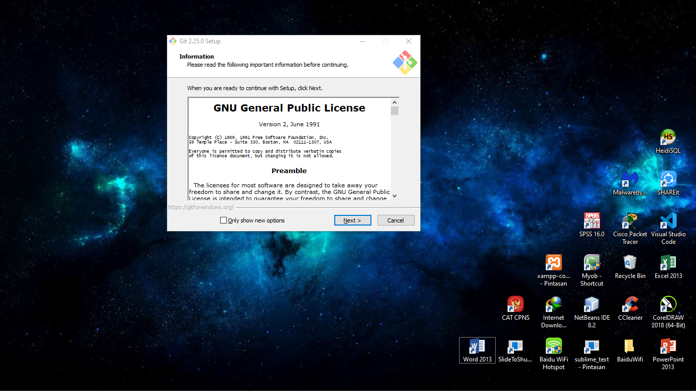

Selanjutnya klik tombol next untuk melanjutkan proses instalasi. Dihalaman berikutnya ke jendela End-User License Agreement, silahkan check A accept the terms in the License Agreement setelah itu klik tombol Next
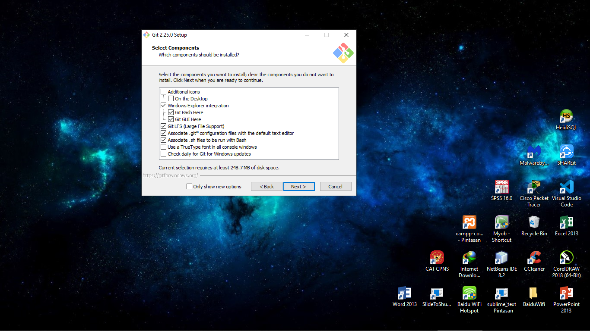

Di halaman Custom Setup, dimana pada jendela ini kalian bisa memilih fitur mariaDB apa saja yang ingin diinstall, saya sarankan pilih saja semua lalu klik tombol Next.
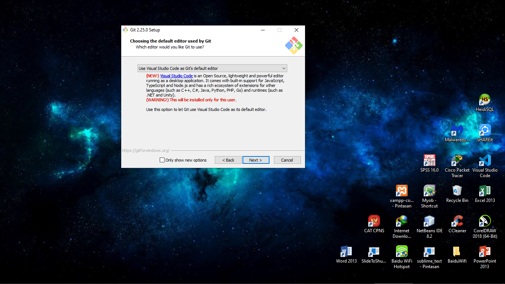

Selanjutnya user akan diminta memasukan password yang nanti akan digunakan untuk membuka database MariaDB, checklist juga Enable access from remote machine for ‘root’ user agar kalian bisa melakukan remot terhadap database MariaDB dan check juga Use UTF8 as default server’s character set. Lalu klik tombol Next.
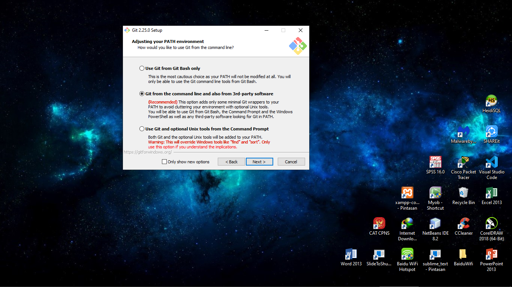

Atur nama service dan port yang akan digunakan, disini user menggunakan settiingan default saja. Lalu klik tombol Next.
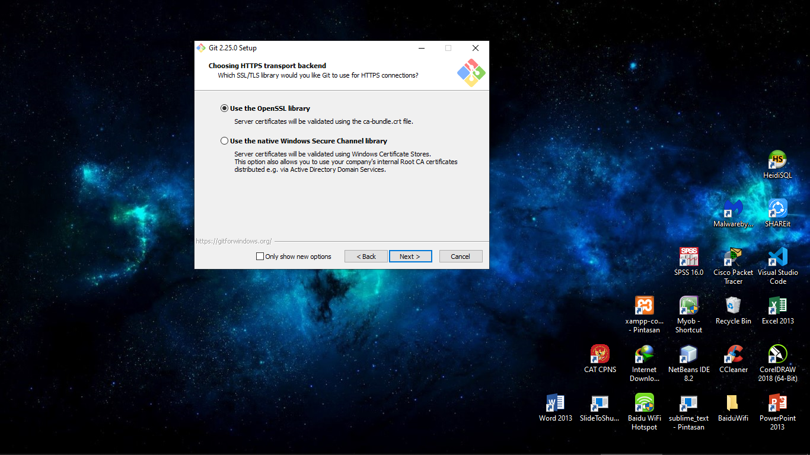

Selanjutnya akan muncul windows Ready to Install MariaDB 10.5, silahkan klik tombol install dan tunggu sampai proses instalasi selesai.

Klik tombol Finish jika proses instalasi telah selesai.

# Latihan 2
---
Untuk latihan yang kedua berisi penjelasan bagaimana langkah untuk membuat database, membuat tabel, menginsert data pada tabel, menghapus data, tabel dan database sesuai dengan tutorial yang ada pada [tutorialspoint](https://www.tutorialspoint.com/sql/). 

----- Membuat Database -----

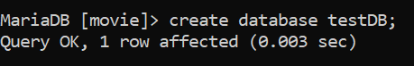

----- Menampilkan Database -----

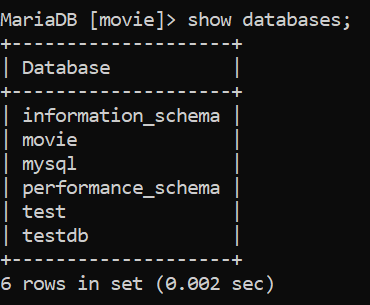

----- Menghapus DataBase -----

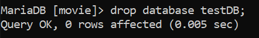

----- Memilih Database -----

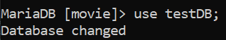

----- Membuat Table -----

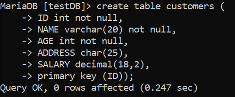

----- Menambahkan Data ke dalam Tabel -----

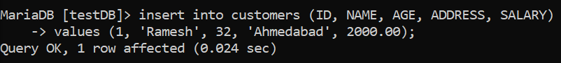

----- Menampilkan Semua Data pada Tabel Customer -----

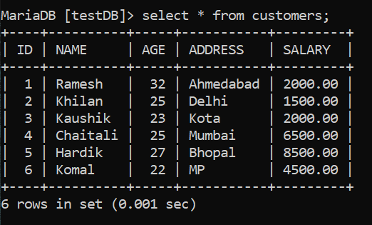

----- Menampilkan Data Nama dan Gaji, berdasarkan Gaji lebih dari 2000 -----

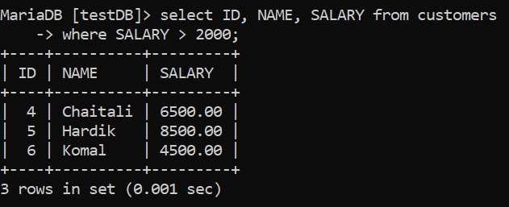

----- Menampilkan Id, Nama dan Gaji berdasarkan Gaji lebih dari 2000 dengan umur dibawah 25 -----

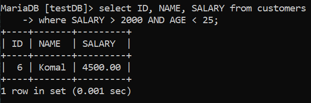

----- Memperbaharui Data Alamat pada Id 6 -----

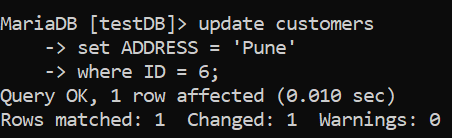

----- Menghapus Data -----

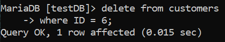

----- Menampilkan semua Data Customers dimana Gaji mulai dari 2000 ----

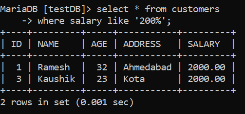

----- Menampilkan 3 Data Teratas -----

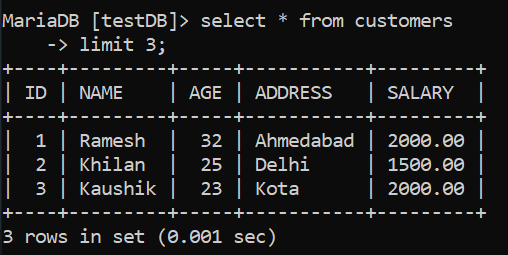

----- Menampilkan urutan naik dari Gaji dan Nama -----

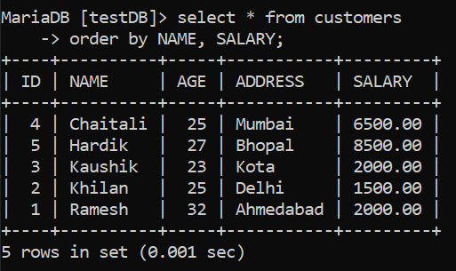

----- Menampilkan satu data pada GAJI atau tidak duplikat ----- 

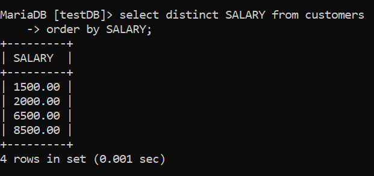