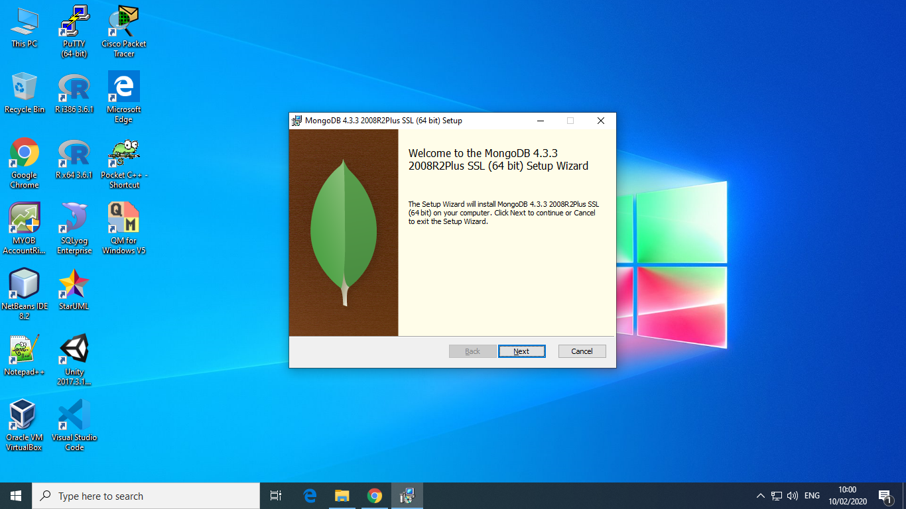
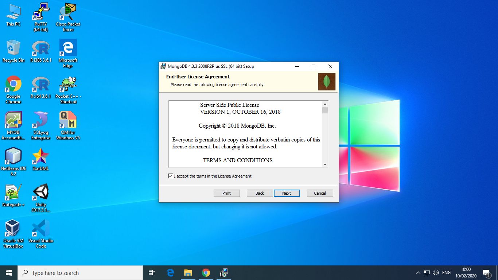
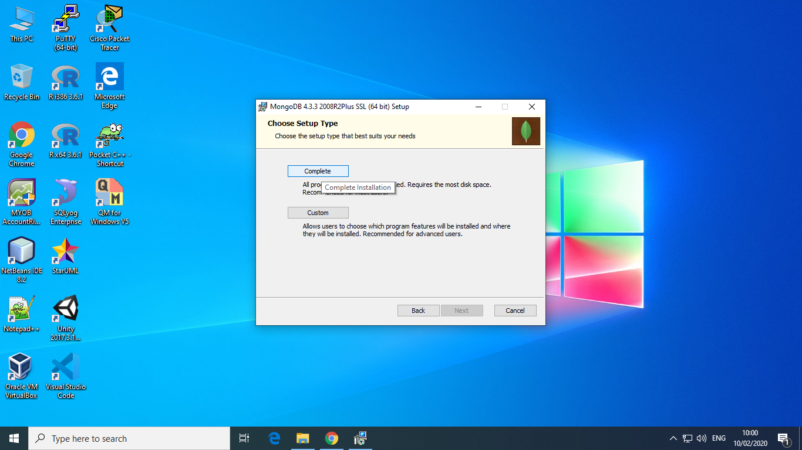
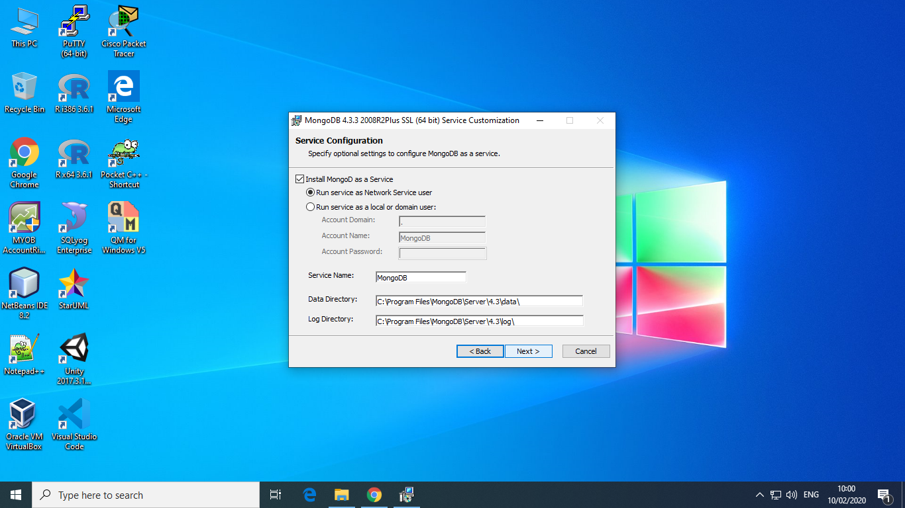
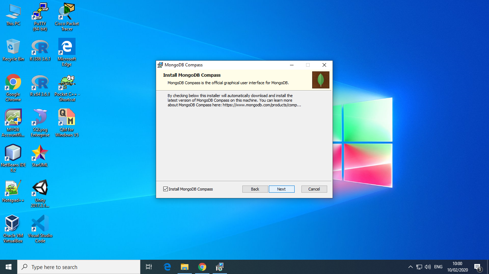

# LATIHAN 
---

## instal dan konfigurasi mongoDB
-----

setelah kita mendownload mongoDB kita akan menginstalnya dengan cara klik double pada file yang telah kita download tadi 

setelah itu klik next

pilih **accept** pada pojok kiri bawah dan klik next

setelah itu muncul tampilan seperti berikut 

saran untuk pemula seperti saya langsung memilih complete aja
setelah memilih complet tekan next

setelah itu kita akan melakukan konfigurasi seperti pada tampilan dibawah ini

selanjutnya klik next

tekan instal tunggu sampai proses isntal selesai

