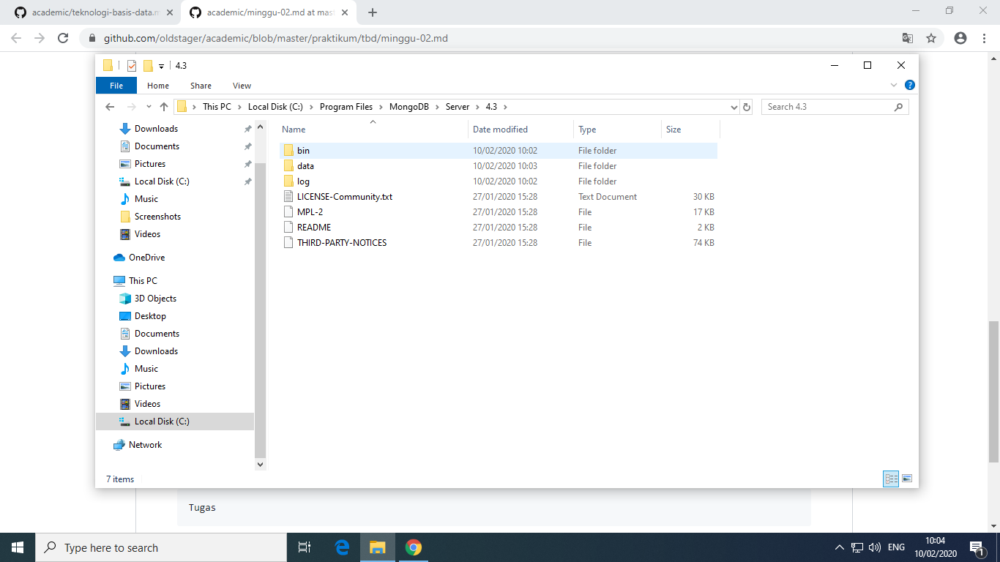
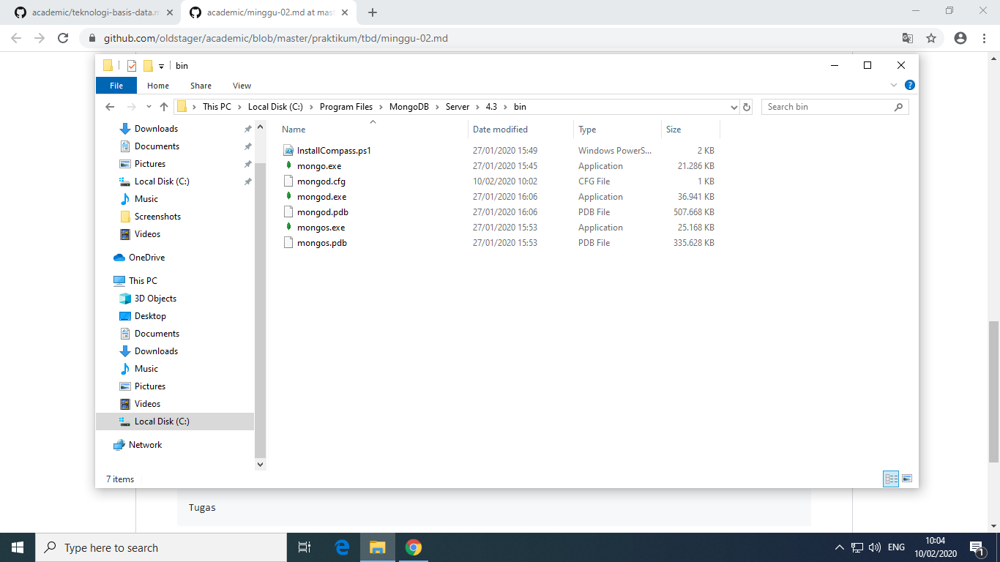
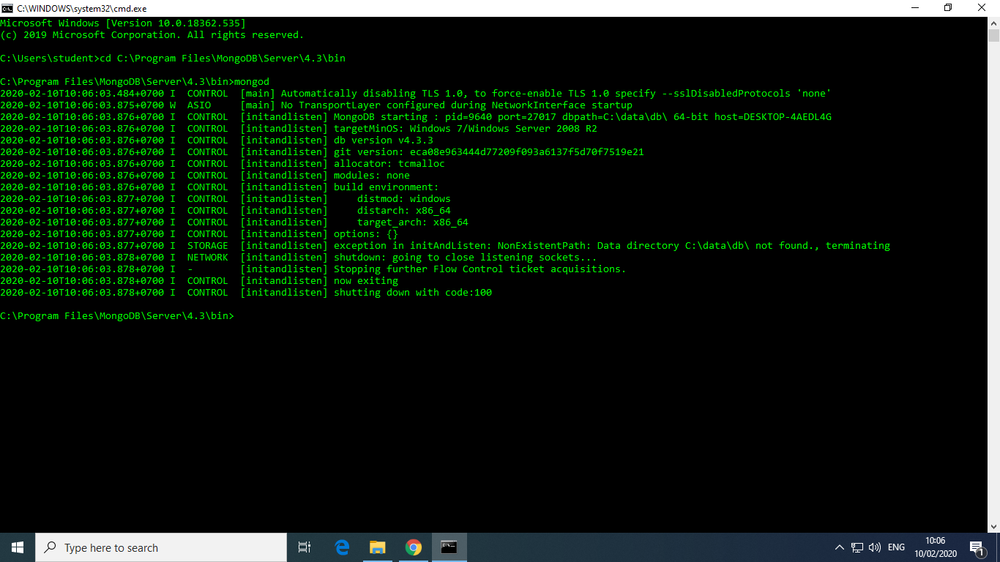
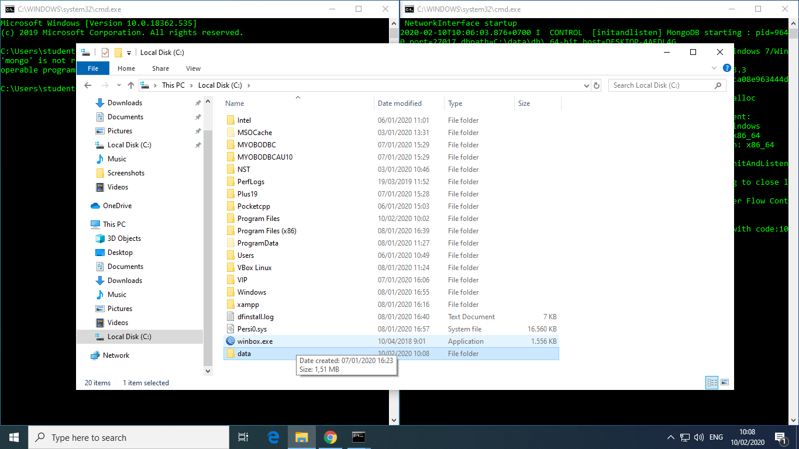
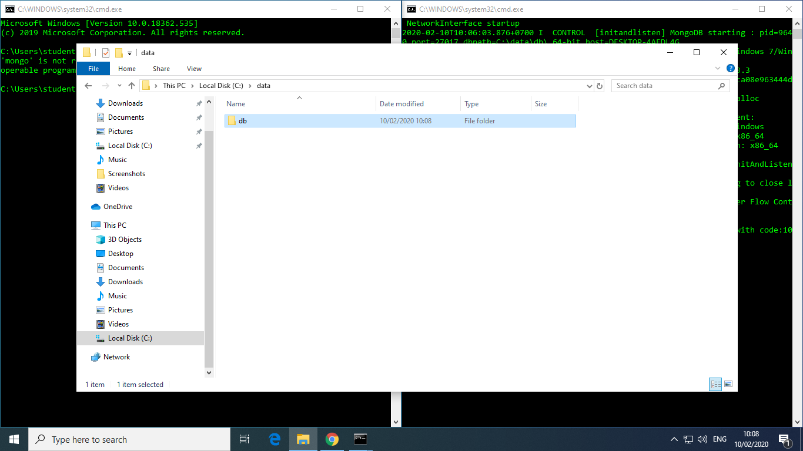
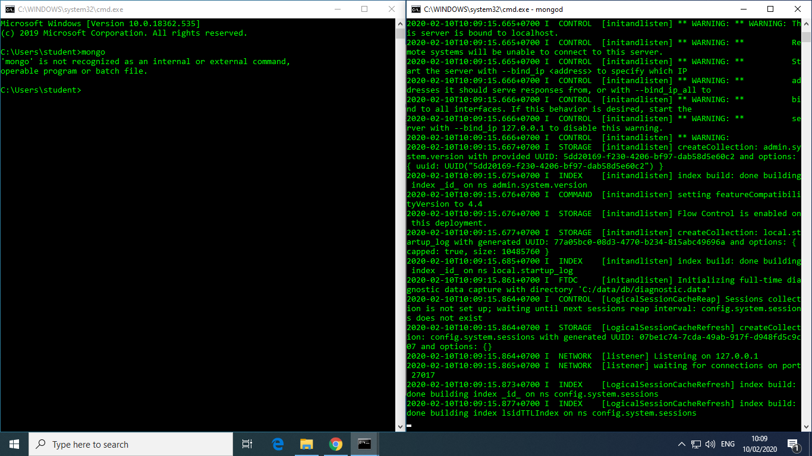
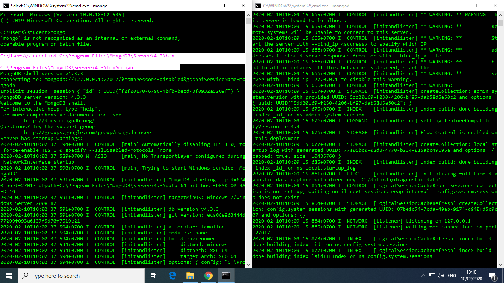
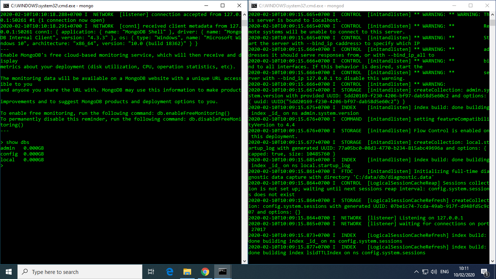

# LATIHAN 
---

## instal dan konfigurasi mongoDB
-----

setelah kita mendownload mongoDB kita akan menginstalnya dengan cara klik double pada file yang telah kita download tadi 

setelah itu klik next

pilih **accept** pada pojok kiri bawah dan klik next

setelah itu muncul tampilan seperti berikut 

saran untuk pemula seperti saya langsung memilih complete aja
setelah memilih complet tekan next

setelah itu kita akan melakukan konfigurasi seperti pada tampilan dibawah ini

selanjutnya klik next

tekan instal tunggu sampai proses isntal selesai

## Jalankan MongoDB server, akses dengan menggunakan mongo shell 
---
1. buka folder penginstlan mongoDB di lokal disc c stetlah itu

2. buka CMD dan masuk ke folder mongoDB dengan cara ***change directori(CD)*** dan ketik mongod utuk melihat data yang ada di dalamnya

3. kemudian kita membuat folder data pada local disck C dan di dalam folder data tersebut di buat folder denga nama db

4. setelah itu kita menginstal mongod pada comand promt nya
dan membuka CMD yang lainnya untuk menjalankan mongo shell nya

