# LATIHAN PERTEMUAN 3
---

## Aktifkan MongoDB server
 setelah mengikuti langkah sebelumya kita telah mengetahui cara untuk menjalankan mongodb sever yaitu dengan cara 
 1. masuk ke tempat penginstalan moggodb seperti pada gambar :
 
 2. setelah itu kita mengkopi lokasi file yang ada dan paste ke **CMD**
 3. karena kita sudah pernah mengintal monggod maka kita hanya perlu memjalankan monggo saja pada **CMD** seperti pada gambar
 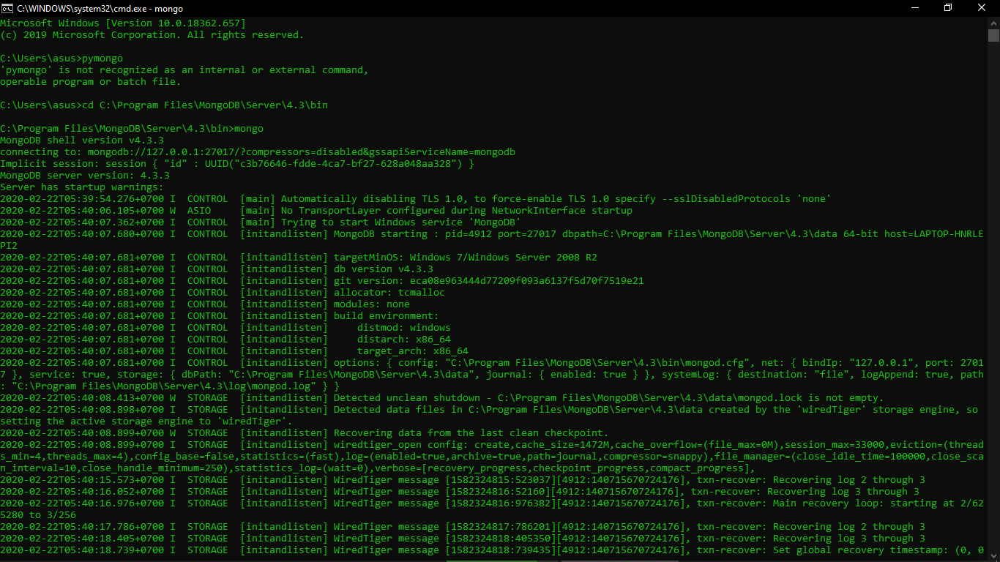
 4. server mongo siap di jalankan

 ## Install Python
 ------
1. Setelah berhasil di download, selanjutnya adalah proses installasi.
2. Double klik pada file installer python yang sudah di download, atau klik kanan lalu pilih Run as Administrator . Jika muncul warning Run as Administrator, silahkan pilih Yes.
3. Centang Install launcher for all users dan Add python to PATH.
4. Kemudian klik Install Now.
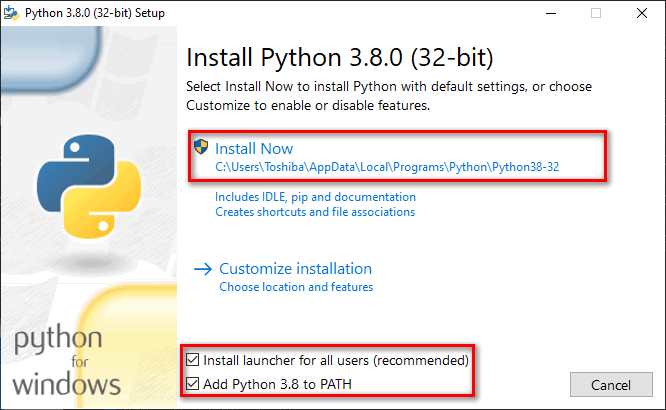
5. Tunggu proses installasi sampai selesai.
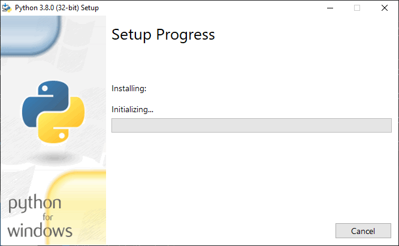
6. Installasi selesai jika sudah muncul “Setup was succesful”.
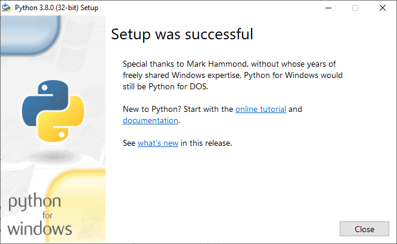
7. Test dengan menggunakan CMD. Coba jalankan perintah python --version.
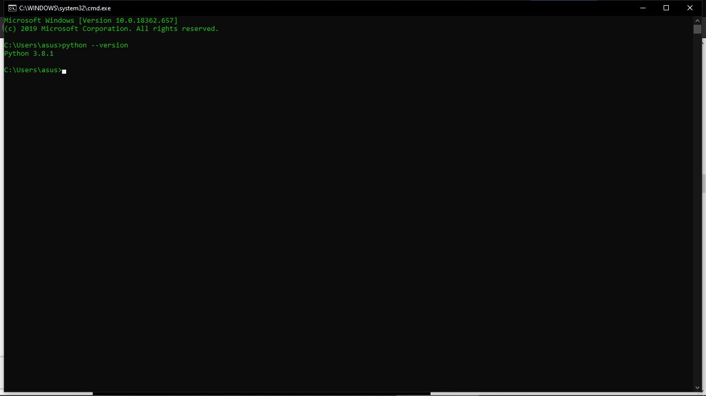
Jika muncul informasi versi Python yang di install maka Python sudah berhasil di instal

## Install Visual Studio Code serta extension untuk Python
------
1. Double klik pada file installer nya atau klik kanan kemudian pilih Run as Administrator.
2. Jika muncul peringatan Run as Administrator, silahkan klik Yes.
3. Pilih “I accept the aggrement” untuk menyetujui “License Agreement”, kemudian klik Next.
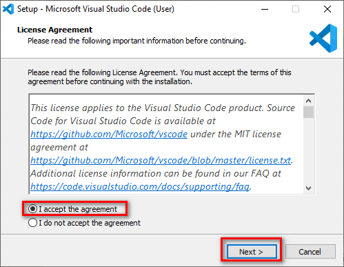
4. Untuk Select Destination Location bisa di biarkan saja jika lokasi installasi tidak akan di rubah. Klik Next.
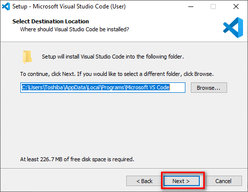
5. Klik Next lagi jika tidak akan merubah Start Menu Folder.
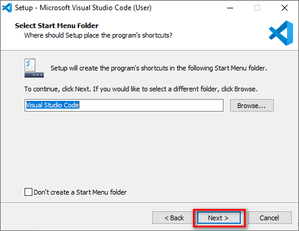
6. Di bagian Select Additional Tasks centang semua. Kemudian Next.
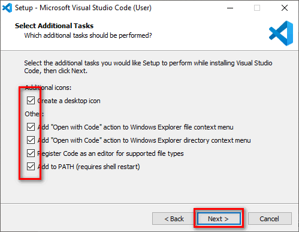
7. Lalu klik Install untuk memulai proses installasi.
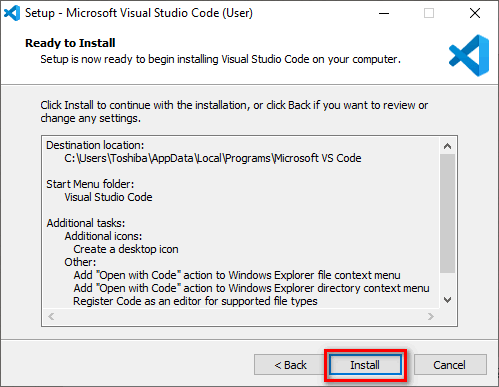
8. Tunggu sampai proses installasi selesai.proses installasi
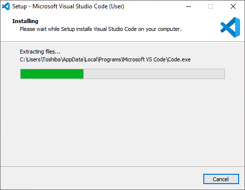
Setelah selesai klik Finish.
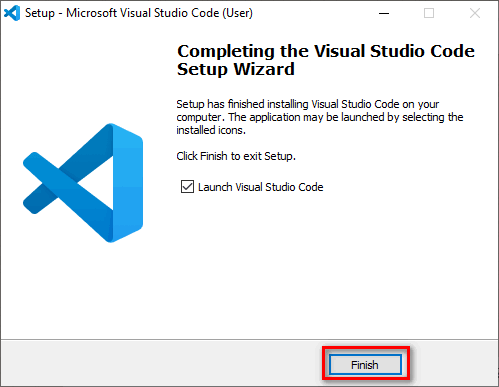

##### Install Extensions
Setelah proses installasi berhasil. Selanjutnya saya akan mencontohkan langkah-langkah install Extensions di Visual Studio Code. Saya akan coba install Extensions Python.
    Buka Visual Studio Code.
1. Klik tab Extensions yang ada di sebelah kiri.
2. Kemudian ketik “Python” di pencarian.
3. Pilih Python.
4. Kemudian klik Install pada Extensions: Python.
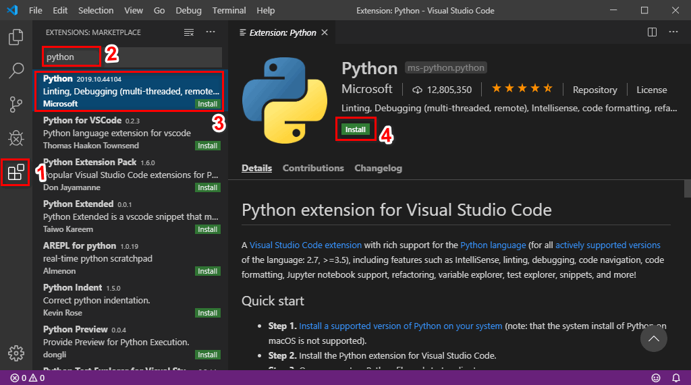

## Kerjakan Instalasi PyMongo
di sini saya mengunakan 2 cara pengfintalan pymonggo yang pertama adalah instal biasa dan yang kedua adalah upgrade dan mengintal ulang simak gambar di bawah ini :
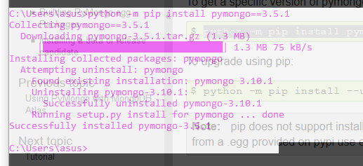
cara instal biasa

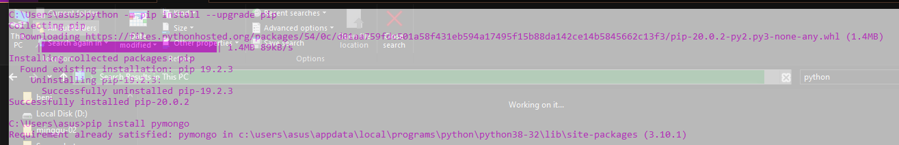
cara isntal dan upgrade

## Kerjakan tutorial materi dan penjelasan nomor 4 di atas.

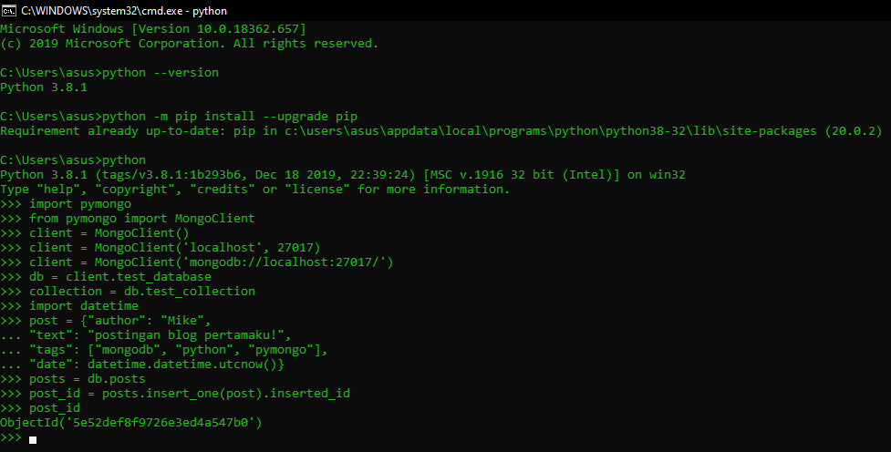

**Membuat Koneksi dengan MongoClient**
Langkah pertama ketika bekerja dengan PyMongo adalah membuat MongoClient ke instance mongod yang sedang berjalan. Melakukannya mudah

**Mendapatkan Database**
Satu contoh MongoDB dapat mendukung banyak basis data independen. Saat bekerja dengan PyMongo Anda mengakses database menggunakan akses gaya atribut pada instance MongoClient

**Mendapatkan Koleksi**
Koleksi adalah sekelompok dokumen yang disimpan dalam MongoDB, dan dapat dianggap kira-kira setara dengan tabel dalam database relasional. Mendapatkan koleksi di PyMongo berfungsi sama dengan mendapatkan database

*Catatan penting tentang koleksi (dan database) di MongoDB adalah bahwa mereka dibuat dengan malas - tidak ada perintah di atas yang benar-benar melakukan operasi apa pun di server MongoDB. Koleksi dan basis data dibuat saat dokumen pertama dimasukkan ke dalamnya.*

**Dokumen**
Data dalam MongoDB diwakili (dan disimpan) menggunakan dokumen gaya JSON. Di PyMongo kami menggunakan kamus untuk mewakili dokumen. Sebagai contoh, kamus berikut dapat digunakan untuk mewakili posting blog:

*Perhatikan bahwa dokumen dapat berisi tipe Python asli (seperti instance datetime.datetime) yang akan secara otomatis dikonversi ke dan dari tipe BSON yang sesuai.*

**Memasukkan Dokumen**
Untuk memasukkan dokumen ke dalam koleksi, kita dapat menggunakan metode insert_one ()
Ketika dokumen dimasukkan kunci khusus, "_id", secara otomatis ditambahkan jika dokumen tersebut belum mengandung kunci "_id". Nilai "_id" harus unik di seluruh koleksi. insert_one () mengembalikan sebuah instance dari InsertOneResult. Untuk informasi lebih lanjut tentang "_id", lihat dokumentasi di _id.

**Mendapatkan Dokumen Tunggal Dengan find_one ()**
Jenis kueri paling dasar yang dapat dilakukan di MongoDB adalah find_one (). Metode ini mengembalikan satu dokumen yang cocok dengan kueri (atau Tidak Ada jika tidak ada yang cocok). Ini berguna ketika Anda tahu hanya ada satu dokumen yang cocok, atau hanya tertarik pada pertandingan pertama. Di sini kami menggunakan find_one () untuk mendapatkan dokumen pertama dari koleksi entri

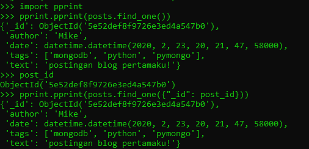

**Permintaan Dengan ObjectId**
Kita juga dapat menemukan posting dengan _id-nya, yang dalam contoh kita adalah ObjectId:
Tugas umum dalam aplikasi web adalah untuk mendapatkan ObjectId dari URL permintaan dan menemukan dokumen yang cocok. Dalam hal ini, perlu untuk mengubah ObjectId dari string sebelum meneruskannya ke find_one

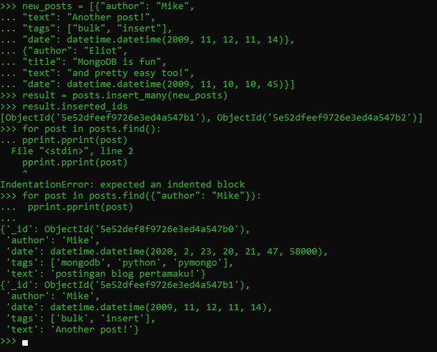

**Sisipan Massal**
Untuk membuat kueri sedikit lebih menarik, mari kita masukkan beberapa dokumen lagi. Selain memasukkan satu dokumen, kami juga dapat melakukan operasi penyisipan massal, dengan meneruskan daftar sebagai argumen pertama yang menyisipkan_many (). Ini akan memasukkan setiap dokumen dalam daftar, hanya mengirimkan satu perintah ke server

Ada beberapa hal menarik yang perlu diperhatikan tentang contoh ini:
         1. Hasil dari insert_many () sekarang mengembalikan dua instance ObjectId, satu untuk setiap dokumen yang dimasukkan.
         2. new_posts [1] memiliki "bentuk" yang berbeda dari pos lainnya - tidak ada bidang "tag" dan kami telah menambahkan bidang baru "judul". Inilah yang kami maksud ketika kami mengatakan bahwa MongoDB bebas skema.

**Meminta Lebih dari Satu Dokumen**
Untuk mendapatkan lebih dari satu dokumen sebagai hasil dari kueri, kami menggunakan metode find (). find () mengembalikan instance kursor, yang memungkinkan kami untuk mengulang semua dokumen yang cocok. Misalnya, kami dapat mengulangi setiap dokumen dalam koleksi pos:

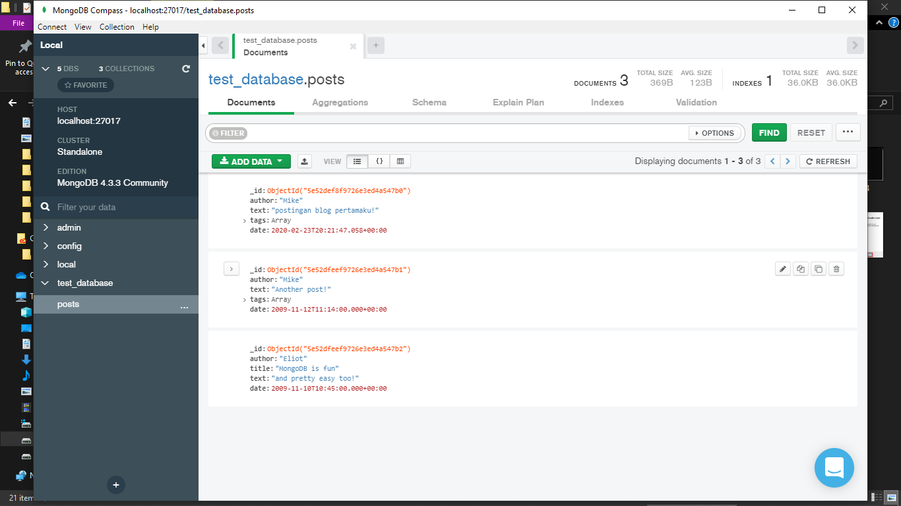
mengunakan mongo kompas untuk melihat data base yang telah di buat agar lebih mudah