# PERTEMUAN 4
---
## Jalankan Redis

User mengunakan Linux Ubuntu maka dari itu tidak perlu menginstall docker lagi karena pada ubuntu sendiri sudah tersedia tools untuk menjalankan redis.

langsung saja bagaimana menjalankan redis pertama kita harus masuk ke terminal. setelah masuk berikut langkah-langkah nya :

1. langka pertama kita mengupdate atau mengupgrade terlebuh dahulu
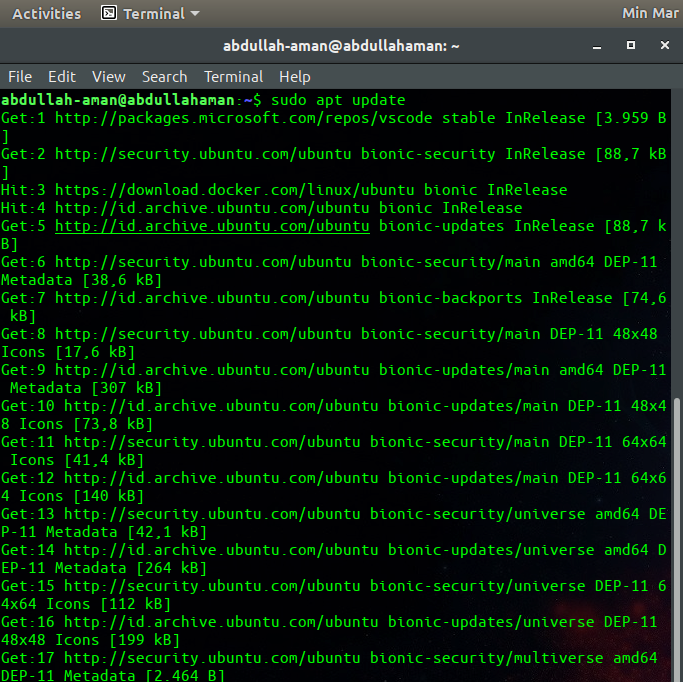

2. kita mengintall redis dengan mengunakan perintah *sudo apt-get install redis* karena di sini saya sudah pernah menginstal maka tampilan nya seperti ini
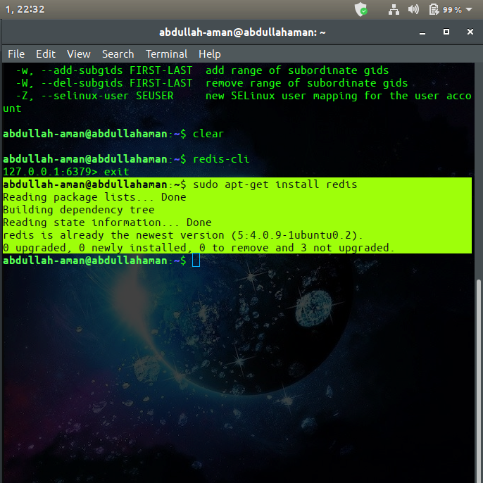

3. setealh itu kita mencari data redis yang tadi sudah terinstall dengan cara *sudo apt-cache search redis* seperti tampilan ini
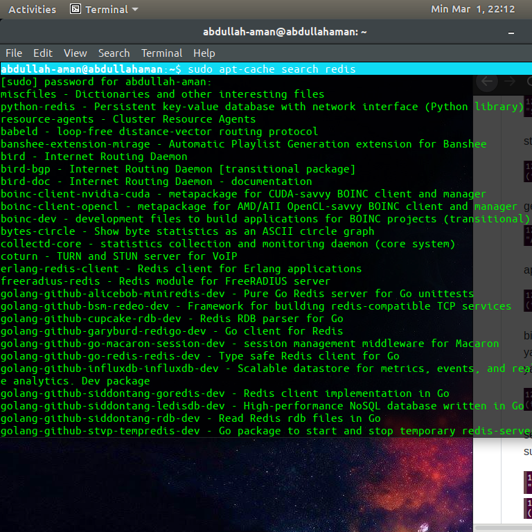
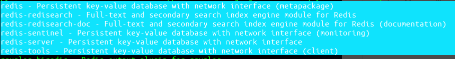

4. setelah kita mencario data yang ada kita menginstall redis tool dan redis server untuk menjalankan redis nantinya
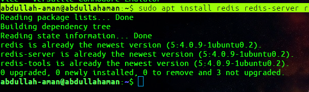

5. setelah itu kita menjalankan redia dengan memangil redis-cli untuk menjalankannya
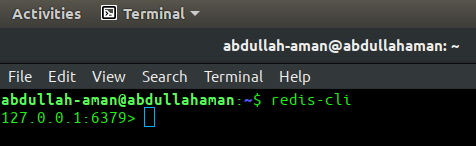

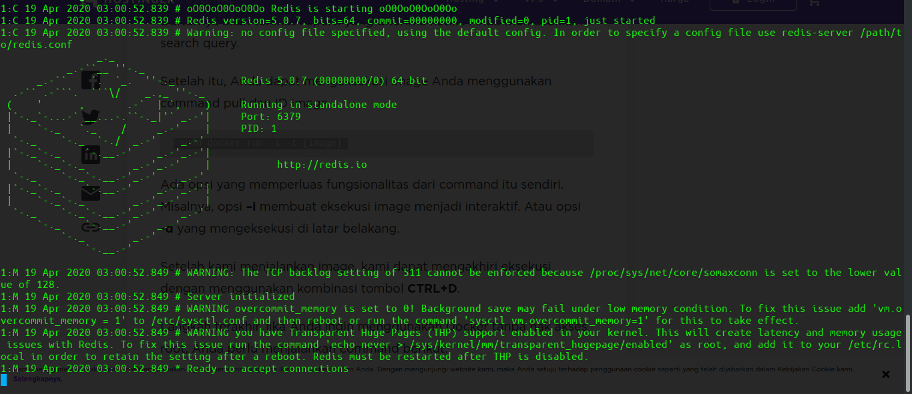

## Kerjakan cli commands serta data types.

1. Menulis Data

Untuk menyimpan nilai dalam Redis, kita dapat menggunakan perintah SET yang memiliki tanda tangan berikut:

	**SET KEY VALUE**

Mari kita lihat sebuah contoh. Dalam jenis shell interaktif:

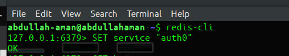

    saat Anda mengetik, shell interaktif menyarankan argumen yang diperlukan dan opsional untuk perintah Redis.

Redis CLI menampilkan saran sintaksis

Tekan enter untuk mengirim perintah. Setelah Redis menyimpan "auth0" sebagai nilai layanan, redis menjawab dengan OK, memberi tahu kami bahwa semuanya berjalan dengan baik.

2. Membaca data

Kita bisa menggunakan perintah GET untuk meminta Redis nilai kunci:

**GET KEY**

Mari kita ambil nilai service:

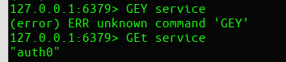

Redis membalas dengan "auth0".

*saya ingin melakukan operasi CRUD: Create, READ, UPDATE, dan DELETE. Kami telah membahas cara membuat (menulis) dan membaca data dalam Redis dengan menggunakan perintah SET dan GET masing-masing. Mari kita bahas sisanya.*

3. Memperbarui Data

Kami dapat memperbarui nilai kunci hanya dengan menimpa datanya seperti yang disebutkan sebelumnya.

Mari kita buat pasangan nilai kunci baru:

SET framework angular

Tapi, kami berubah pikiran dan sekarang kami ingin nilainya menjadi "react". Kita dapat menimpanya seperti ini:

SET framework react

GET framework

Redis memang membalas dengan "react". Kami sedikit ragu-ragu dan sekarang kami ingin mengatur kunci framework untuk mempertahankan nilai "vue":

SET framework vue

Jika kita menjalankan GET framework lagi, kita mendapat "vue". Pembaruan / menimpa berfungsi sebagai dikecualikan.

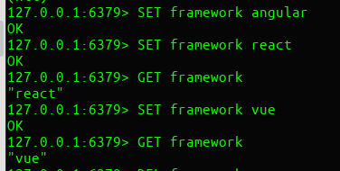

4. Menghapus Data

Tapi, kami tidak ingin benar-benar menetapkan kerangka kerja apa pun untuk saat ini dan kami perlu menghapus kunci itu. Bagaimana kita melakukannya? Kami menggunakan perintah DEL:

DEL key

Mari kita jalankan:

DEL framework

Redis membalas dengan (integer) 1 untuk memberi tahu kami jumlah kunci yang dihapus.

Dengan hanya tiga perintah, SET, GET, dan DEL, kami dapat mematuhi empat operasi CRUD!

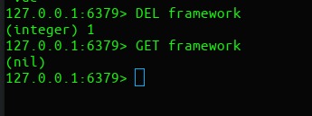

