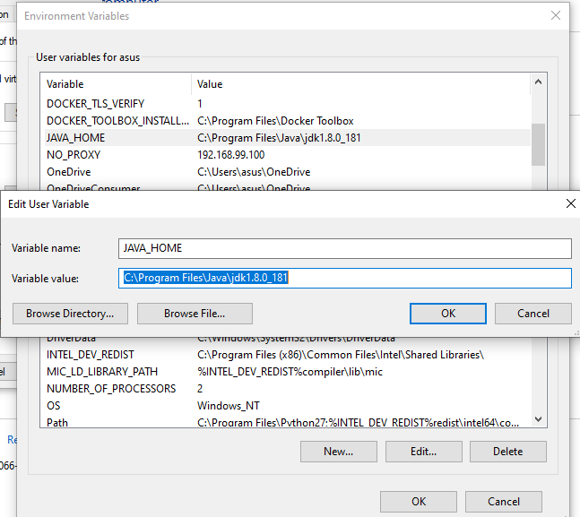

# PERTEMUAN 6
---
## Install Apache Cassandra hinggal bisa dijalankan server dan cqlsh

1. install jdk 
	di sini saya telah menginstall jdk dari lama jadi saya tidak perlu menginstall ulang
	
2. Menentukan variabel JAVA_HOME di Windows.
	Pada File Explorer, klik kanan This PC lalu pilih Properties.
	
	Pada layar Systems, klik tombol Advanced system setting.
	
    Pada layar System Properties, klik tombol Environment Variables.
	
  
	Di bawah System variables, klik tombol New.
    Tampil layar New System Variable.
	Di kotak teks Variable name, ketikkan JAVA_HOME.
    Klik tombol Browse Directory…
    Muncul layar Browse For Folder.
	Arahkan ke folder C:\Program Files\Java\jdk1.8.0_241
    Klik tombol OK
	
	Pada layar New System Variable di kotak teks Variable value telah berisi teks sesuai dengan folder yang telah dipilih sebelumnya.
    Selanjutnya klik tombol OK.
    Pada layar Environmental Variables, klik tombol OK
    Pada layar System Properties, klik tombol OK
	
	
3. Instalasi Python2.7
	di sini juga saya telah menginstall python2.7 tapi ada hal yang harus di ketahui sebelum menginstall
	lakuan cara yang di bawah ini :
	
	
	
4. Instalasi Apache Cassandra
	setelah di download kemudian Ekstrak file apache-cassandra-3.11.4-bin.tar ke drive C.
    Gunakan WinZip,Winrar atau perangkat lunak lain yang sejenis.
    Tentukan variabel lingkungan sistem untuk Cassandra
	Lakukan hal yang sama seperti pada penentuan variable JAVA_HOME di atas sampai muncul layar New System Variable.
    Pada kotak teks Variable name, ketikkan CASSANDRA_HOME.
    Pada kotak teks Variable value, ketikkan C:\apache-cassandra-3.11.4. Cara lain adalah dengan mengklik tombol Browse Directory, lalu arahkan ke folder apache-cassandra-3.11.4.
    Klik tombol OK.
	
    Selanjutnya, masih pada layar Environment Variables berikut:
	Di bawah System variables, klik ganda variabel Path.
    Tampil layar Edit environment variable.
	
	Pilih: | New | Browse |, lalu arahkan ke folder C:\apache-cassandra-3.11.4\bin
    Klik tombol OK.
	
	setelah itu kembali pada driver c buka apach cassandra dan buka bin lalu edit file cassandra
	
	dan tambahkan JAVA_HOME seperti pada tampilan di atas
	
	setelah itu buka command promnt dan ketikan cassandra -f tunggu sampai instalasi selesai
	
5. Menjalankan Apache Cassandra
buka command promnt lainnya dan ketikan cqlsh selamat cassandra siap di jalankan

